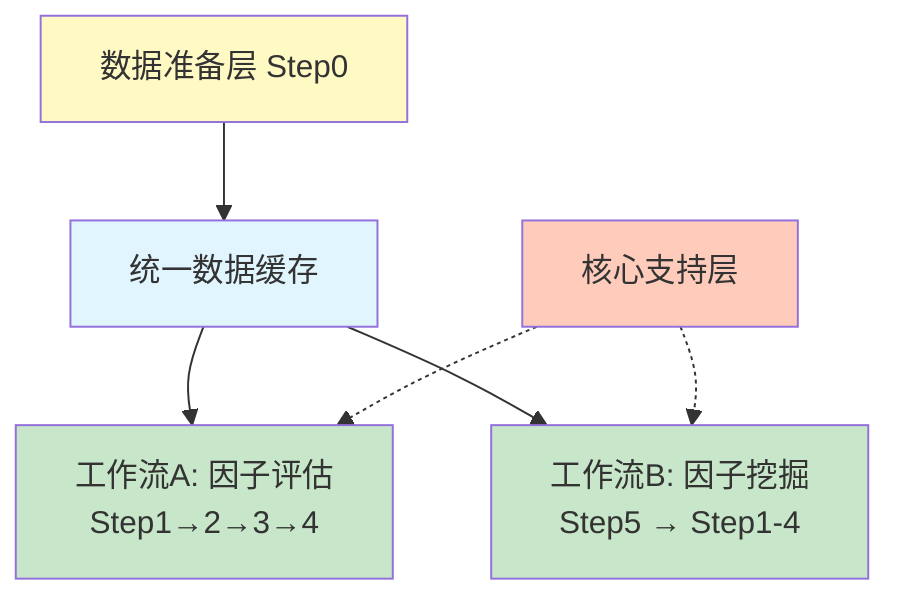

# 量化因子研究平台 - 系统架构

## Coding Agent 工作准则

### 强制规则（最高优先级）

**以下规则对 Agent 行为具有强制约束力，优先级高于本页其他内容：**

- [编码规则（强制）](rules/CODING_RULES.md) - Agent 编码与重构行为约束规范
- [文档编写规则（强制）](rules/DOC_RULES.md) - Agent 撰写文档、设计说明、分析报告时的输出约束

---

### 工作方式

1. **语言**: 中文回复
2. **文件管理**: 不要随意生成文件，如需创建，必须先获得用户许可
3. **工作流程**: 先分析、规划、确认，再执行；主动扫描引用关系，不要询问

---

### 环境配置

1. **依赖环境**: 见 `.claude_env` 文件
2. **代码质量**: 项目使用 pre-commit 机制，在代码提交前会自动进行 Ruff 检查

---

## 系统架构图

---

## Pipeline 工作流

| 工作流 | 场景 | 流程 |
|--------|------|------|
| **A: 因子评估** | 灵感验证 / 对比评估 | `Step1 → Step2 → Step3 → Step4` |
| **B: 因子挖掘** | 测试集自动挖掘 → 验证集评估 | `Step5 (测试集) → Step1-4 (验证集)` |

---

## 参考

详细用法请参考各 Step 的 README 文档

> 注：Step0 需最先执行，生成统一数据缓存
